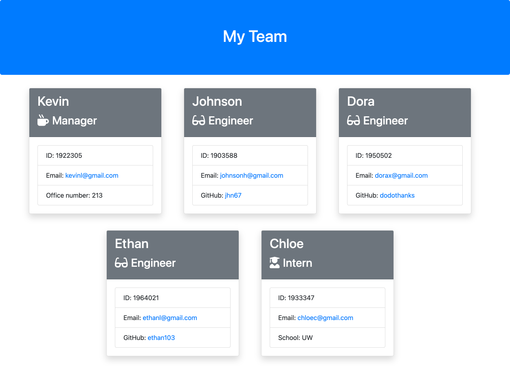

# Employee-Template-Engine

## Task

The purpose of this assignment is to create a Team-Generator which is a command-line application for a special project team to generate a profile web page of all team members. This application can be used to generate the different roles of a team included manager, engineer, and intern. Each role would also includes name, id number, and email address. Manager would specially has office number, while engineers would have their github names and interns have their school names. The dependencies are inquirer npm package, which contributes to the function of prompt questions to collect team members' information, and jest, which provides the test to functionality of the constructor codes.

## Functionality

Below is the example of a team profile summary generated by this application:
